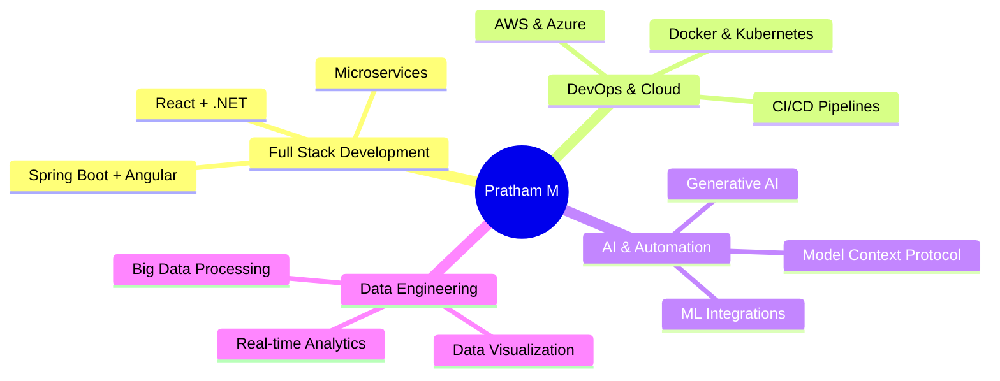

<div align="center">
  
# 👋 Hi, I'm Pratham M

### Associate Software Engineer | Full-Stack Developer | DevOps Enthusiast

<p align="center">
  <a href="https://www.linkedin.com/in/pratham-m16"></a>
  <a href="mailto:pratham.m1605@gmail.com"></a>
  <a href="https://github.com/PrathamM16"></a>
</p>


</div>

---

## 🚀 About Me

```typescript
const pratham = {
    location: "Bengaluru, Karnataka 🇮🇳",
    role: "Associate Software Engineer @ Trivium eSolution",
    education: "MCA from CHRIST University",
    currentFocus: ["React", "Spring Boot", "DevOps", "AI Integration"],
    interests: ["Full-Stack Development", "Cloud Computing", "Data Analytics", "AI Automation"],
    funFact: "I automate everything - from emails to GitHub repos using AI! 🤖"
};
```

🔭 **Currently Working On:**  
- Building scalable React applications with D3 visualizations  
- Implementing AI-powered automation systems using Model Context Protocol  
- DevSecOps pipelines with Jenkins, Docker & Kubernetes

🌱 **Currently Learning:**  
- Advanced AI integrations & Generative AI  
- Cloud-native architecture patterns  
- Microservices with Spring Boot & Kafka

👯 **Open to:**  
- Collaborative projects in Full-Stack Development  
- Open source contributions  
- Innovative AI/ML applications

---

## 💼 Professional Experience

<table>
<tr>
<td width="50%">

### 🏢 Trivium eSolution
**Associate Software Engineer** *(Oct 2025 - Present)*  
- React + .NET development
- D3 Charts & Data Visualization
- Component Library (Storybook)

**Trainee** *(Jul 2025 - Sep 2025)*  
- Built MCP automation system
- Integrated Claude AI with Gmail, GitHub, Fi App
- AI-driven workflow automation

</td>
<td width="50%">

### 💡 Key Projects
**Intern** *(Jan 2025 - Jun 2025)*  
- AI Security Vulnerability Tool (80% time saved)
- Full-stack E-Commerce with Kafka
- DevSecOps CI/CD Pipeline
- Admin Dashboard with Analytics

</td>
</tr>
</table>

---

## 📊 GitHub Statistics

<div align="center">
  


</div>

<div align="center">
  


</div>

---

## 🛠️ Tech Stack

### 💻 Languages


### 🎨 Frontend Development


### ⚙️ Backend Development


### 🗄️ Databases


### ☁️ Cloud & DevOps


### 🤖 AI & Data Science


### 🛠️ Tools & Others


---

## 🏆 Featured Projects

<table>
<tr>
<td width="50%">

### 🔐 AI Security Vulnerability Tool
**Technologies:** Python, OpenAI API, Ollama  
Automated penetration test report analysis extracting CVSS scores, CWE/CVE IDs with **80% time reduction**.

**Key Features:**
- PDF processing & data extraction
- Structured vulnerability reporting
- Local deployment with Ollama

</td>
<td width="50%">

### 🛒 Full-Stack E-Commerce Platform
**Technologies:** Angular, Spring Boot, MySQL, Kafka  
Complete e-commerce solution with real-time order processing.

**Key Features:**
- Kafka message broker integration
- SMTP OTP authentication
- Admin dashboard with analytics
- Inventory management system

</td>
</tr>

<tr>
<td width="50%">

### 🤖 MCP Automation System
**Technologies:** Claude AI, MCP, APIs  
Advanced personal automation connecting Gmail, GitHub, and Finance apps.

**Key Features:**
- Natural language GitHub operations
- Email workflow automation
- Real-time finance data analysis

</td>
<td width="50%">

### 📊 Namma Yatri Sentiment Analysis
**Technologies:** Python, LDA, K-Means, ML Models  
Analyzed 11,000+ app reviews for sentiment and topic extraction.

**Key Features:**
- LDA topic modeling
- SVM, Random Forest classification
- VADER & TextBlob validation
- [Read Medium Article →](#)

</td>
</tr>
</table>

---

## 🎯 Current Focus Areas



---

## 📈 Contribution Activity

<div align="center">

[](https://github.com/PrathamM16)

</div>

---

## 🎓 Education

<table>
<tr>
<td width="50%">

### 🎓 Christ University, Bengaluru
**Master of Computer Applications (MCA)**  
📅 2023 - 2025 | 📊 68.61%

**Focus Areas:**
- Advanced Software Development
- System Design & Architecture
- Cloud Computing & DevOps
- AI & Machine Learning

</td>
<td width="50%">

### 🎓 St. Joseph's College, Bengaluru
**B.Sc. (Computer Science, Mathematics, Electronics)**  
📅 2020 - 2023 | 📊 70.35%

**Focus Areas:**
- Computer Science Fundamentals
- Mathematics & Analytics
- Electronics & Embedded Systems
- Software Engineering

</td>
</tr>
</table>

---

## 📜 Certifications & Research

### 📚 Research Publications
- **"Data Security in Cloud Computing"** (March 2024) - Research on security challenges in cloud computing for critical applications

### 🏅 Certifications
- ✅ Machine Learning Specialization
- ✅ AWS Academy Cloud Foundations
- ✅ Web Design Certification
- ✅ DevOps with Jenkins, Ansible, Kubernetes (Udemy)
- ✅ Android App Development Workshop - CHRIST University

### 💼 Educational Internships
- **SwipeGen Technologies** - Computer Vision with Microsoft Azure
- **Run Shaw Technologies** - Machine Learning with 5,000+ record datasets

---

## 🎨 Beyond Code

When I'm not coding, I'm creating:

🎨 **Design & Content Creation**
- Infographic Design
- Video Editing
- Poster Creation
- Medium Blog Writing

---

## 📫 Let's Connect!

<div align="center">

[](https://www.linkedin.com/in/pratham-m16)
[](mailto:pratham.m1605@gmail.com)
[](https://github.com/PrathamM16)
[](#)

</div>

---

<div align="center">

### 💡 "Automating the future, one line of code at a time!"


**⭐ Star my repositories if you find them useful!**

</div>

---

<div align="center">
  
</div>
