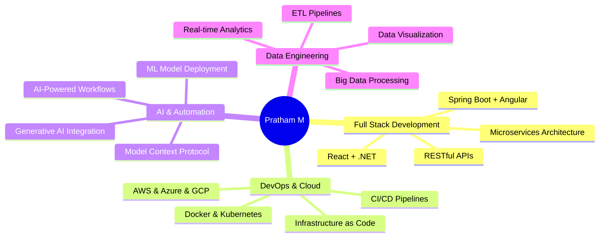

<div align="center">
  
</div>

<div align="center">
  
[](https://git.io/typing-svg)

</div>

<p align="center">
  <a href="https://www.linkedin.com/in/pratham-m16">
    
  </a>
  <a href="mailto:pratham.m1605@gmail.com">
    
  </a>
  <a href="https://github.com/PrathamM16">
    
  </a>
  
</p>

<div align="center">
  
</div>

<br>

## 🚀 About Me


```javascript
const pratham = {
    location: "Bengaluru, Karnataka 🇮🇳",
    company: "Trivium eSolution Pvt Ltd",
    role: "Associate Software Engineer",
    education: "MCA @ CHRIST University",
    code: ["Python", "Java", "JavaScript", "TypeScript", "Go", "Kotlin"],
    technologies: {
        frontEnd: {
            js: ["React", "Angular", "D3.js"],
            css: ["Styled Components", "Tailwind", "Bootstrap"]
        },
        backEnd: {
            java: ["Spring Boot", "Hibernate"],
            dotnet: [".NET Core"],
            js: ["Node.js", "Express"]
        },
        databases: ["MySQL", "Firebase"],
        devOps: ["Docker🐳", "Kubernetes☸️", "Jenkins", "AWS", "Azure"],
        ai: ["OpenAI API", "Claude AI", "MCP", "TensorFlow"],
        tools: ["Git", "SonarQube", "Prometheus", "Grafana"]
    },
    currentFocus: "Building AI-powered automation & scalable cloud solutions",
    funFact: "I automate everything - from emails to GitHub repos using AI! 🤖"
};
```

<br>

### 🎯 What I'm Up To

```diff
+ 🔭 Building scalable React applications with D3 data visualizations
+ 🤖 Implementing AI-powered automation using Model Context Protocol
+ ⚙️ Developing DevSecOps pipelines with Jenkins, Docker & Kubernetes
+ 🌱 Learning advanced Generative AI and cloud-native architectures
+ 👯 Open to collaborate on innovative Full-Stack & AI/ML projects
+ 💡 Exploring microservices architecture with Spring Boot & Kafka
```

<div align="center">
  
</div>

<br>

## 💼 Professional Journey

<table>
<tr>
<td width="50%" valign="top">

### 🏢 **Trivium eSolution Pvt Ltd**

**🔹 Associate Software Engineer** *(Oct 2025 - Present)*
- 🎨 React + .NET full-stack development
- 📊 D3 Charts & Advanced Data Visualization
- 📚 Component Library Development (Storybook)
- 🎯 Styled Components & Modern CSS Architecture

**🔹 Trainee** *(Jul 2025 - Sep 2025)*
- 🤖 Built advanced MCP automation system
- 🔗 Integrated Claude AI with Gmail, GitHub, Fi App
- ⚡ AI-driven workflow automation
- 🔒 Secure API integrations & config management

</td>
<td width="50%" valign="top">

### 💡 **Key Achievements**

**🔹 Intern** *(Jan 2025 - Jun 2025)*

🎯 **AI Security Tool**
- Reduced manual analysis time by **80%**
- PDF processing with CVSS/CVE extraction
- OpenAI API + Ollama integration

🛒 **E-Commerce Platform**
- Full-stack Angular + Spring Boot
- Kafka message broker
- SMTP OTP authentication
- Admin dashboard with analytics

🔧 **DevSecOps Pipeline**
- Jenkins CI/CD automation
- SonarQube code quality analysis
- Prometheus + Grafana monitoring
- Complete Docker containerization

</td>
</tr>
</table>

<div align="center">
  
</div>

<br>

## 📊 GitHub Analytics

<p align="center">
  
  
</p>

<p align="center">
  
  
</p>

<div align="center">
  


</div>

<div align="center">
  
</div>

<br>

## 🛠️ Tech Arsenal

<div align="center">

### 💻 Programming Languages

<p>
  
</p>

### 🎨 Frontend Technologies

<p>
  
</p>

### ⚙️ Backend & Databases

<p>
  
</p>

### ☁️ Cloud & DevOps

<p>
  
</p>

### 🤖 AI/ML & Data Science

<p>
  
  
  
  
  
</p>

### 🛠️ Tools & Platforms

<p>
  
  
  
  
  
</p>

</div>

<div align="center">
  
</div>

<br>

## 🏆 Featured Projects

<div align="center">

<table>
<tr>
<td width="50%" valign="top">

### 🔐 AI Security Vulnerability Tool
[](#)


**🎯 Impact: 80% Time Reduction**

Automated penetration testing report analysis with AI-powered extraction of CVSS scores, CWE/CVE IDs, and severity classifications.

**✨ Key Features:**
- 📄 PDF processing & intelligent data extraction
- 🎯 Structured vulnerability reporting
- 🔒 Local deployment with Ollama
- ⚡ Real-time analysis dashboard

</td>
<td width="50%" valign="top">

### 🛒 E-Commerce Platform
[](#)


Complete e-commerce solution with real-time order processing and microservices architecture.

**✨ Key Features:**
- 🔄 Kafka message broker integration
- 🔐 SMTP OTP authentication
- 📊 Admin dashboard with analytics
- 📦 Advanced inventory management
- 🚚 Real-time delivery tracking

</td>
</tr>

<tr>
<td width="50%" valign="top">

### 🤖 MCP Automation System
[](#)


Revolutionary personal automation system connecting multiple services through AI-powered natural language interface.

**✨ Key Features:**
- 📧 Automated email workflows
- 🔗 Natural language GitHub operations
- 💰 Real-time finance data analysis
- 🔒 Secure multi-service integration
- 🎯 Custom automation triggers

</td>
<td width="50%" valign="top">

### 📊 Namma Yatri Sentiment Analysis
[](#)
[](#)


**📊 Dataset: 11,000+ Reviews**

Advanced sentiment and topic analysis using multiple ML models and NLP techniques.

**✨ Key Features:**
- 🎯 LDA topic modeling & K-Means clustering
- 🤖 SVM, Random Forest, Neural Networks
- ✅ VADER & TextBlob validation
- 📈 TF-IDF feature extraction
- 📊 Interactive visualizations

</td>
</tr>

<tr>
<td width="50%" valign="top">

### 📱 CHRIST Visitor Management App
[](#)


Enterprise-grade visitor tracking and management system for campus security.

**✨ Key Features:**
- 🎫 Automated QR code generation
- 📧 Email notification system
- 🔒 Secure entry/exit logging
- 💬 Department communication portal
- 📊 Real-time analytics dashboard

</td>
<td width="50%" valign="top">

### ⚙️ DevSecOps CI/CD Pipeline
[](#)


Complete DevSecOps pipeline implementation with automated testing, security scanning, and monitoring.

**✨ Key Features:**
- 🔄 Automated CI/CD workflows
- 🔍 SonarQube code quality gates
- 📊 Prometheus + Grafana monitoring
- 🐳 Docker containerization
- ☸️ Kubernetes orchestration
- 🔒 Security vulnerability scanning

</td>
</tr>
</table>

</div>

<div align="center">
  
</div>

<br>

## 🎯 Technical Expertise

<div align="center">



</div>

<div align="center">
  
</div>

<br>

## 🎓 Education & Certifications

<div align="center">

### 🎓 Academic Excellence

<table>
<tr>
<td width="50%" align="center">


**Master of Computer Applications**  
🏛️ CHRIST (Deemed to be University)  
📅 July 2023 - April 2025  
📊 CGPA: 68.61%

**Specializations:**
- Advanced Software Development
- System Design & Architecture
- Cloud Computing & DevOps
- AI & Machine Learning

</td>
<td width="50%" align="center">


**Bachelor of Science**  
🏛️ St. Joseph's College (Autonomous)  
📅 August 2020 - May 2023  
📊 Percentage: 70.35%

**Major:** Computer Science, Mathematics, Electronics

**Focus Areas:**
- CS Fundamentals & Algorithms
- Mathematics & Statistical Analysis
- Electronics & Embedded Systems

</td>
</tr>
</table>

<br>

### 🏅 Professional Certifications

<table>
<tr>
<td width="33%" align="center">


**Google Cloud Agentic AI Day**  
Hack2skill  
*Sep 2025*  
**Skills:** Model Context Protocol

<details>
<summary>🔗 Credential ID</summary>
2025H2S06AID-I20464
</details>

</td>
<td width="33%" align="center">


**Entity Framework in Depth**  
Udemy  
*Sep 2025*  
**Skills:** .NET, EF Core, Database Design

<details>
<summary>🔗 Credential ID</summary>
UC-721f1626d-39b6-40a5-a8a9-dece3967a9e4
</details>

</td>
<td width="33%" align="center">


**DevOps Project 1**  
Udemy  
*Aug 2025*  
**Skills:** Jenkins, Ansible, Kubernetes

<details>
<summary>🔗 Credential ID</summary>
UC-56eae0b7-0ea6-471d-a9df-a05030ac31f2
</details>

</td>
</tr>

<tr>
<td width="33%" align="center">


**Learning REST APIs**  
LinkedIn Learning  
*Jun 2024*  
**Skills:** REST APIs, HTTP Methods

<details>
<summary>🔗 Credential ID</summary>
a467438c8f1f25875b5ac8a82448c536834...
</details>

</td>
<td width="33%" align="center">


**AWS Academy Cloud Foundations**  
Amazon Web Services  
*2024*  
**Skills:** EC2, IAM, S3, Cloud Architecture

</td>
<td width="33%" align="center">


**Machine Learning Specialization**  
Online Course  
*2024*  
**Skills:** Supervised & Unsupervised Learning

</td>
</tr>

<tr>
<td colspan="3" align="center">


**Android App Development Workshop**  
CHRIST University  
*Outstanding Participation & Presentation Award*

</td>
</tr>
</table>

<br>

### 📚 Research & Publications

<table>
<tr>
<td align="center">


**"Data Security in Cloud Computing"**  
📅 March 2024  
🔬 Research Paper

Comprehensive analysis of data security challenges in cloud computing environments for critical applications, covering encryption, access control, and compliance frameworks.

[](#)

</td>
</tr>
</table>

<br>

### 💼 Educational Internships

<table>
<tr>
<td width="50%" align="center">


**SwipeGen Technologies**  
*Computer Vision Specialist*

Specialized in Computer Vision using **Microsoft Azure** cloud platform, exploring AI-based solutions for cloud-based CV applications.

**Tech Stack:**
- Azure Cognitive Services
- Computer Vision APIs
- Azure ML Studio

</td>
<td width="50%" align="center">


**Run Shaw Technologies**  
*ML Engineer Intern*

Implemented Machine Learning algorithms for processing and analyzing datasets with **5,000+ records**.

**Tech Stack:**
- Python, scikit-learn
- Data Preprocessing
- Model Optimization

</td>
</tr>
</table>

</div>

<div align="center">
  
</div>

<br>

## 📈 Contribution Activity

<div align="center">

[](https://github.com/PrathamM16)

</div>

<details>
<summary>🔍 <b>View Detailed Contribution Stats</b></summary>
<br>

<div align="center">


</div>

</details>

<div align="center">
  
</div>

<br>

## 🎨 Beyond Code

<div align="center">


### Creative Skillset

When I'm not coding, I'm creating visual stories and engaging content!

<table>
<tr>
<td align="center" width="25%">
<br>
<b>Infographic Design</b><br>
Creating stunning visual narratives
</td>
<td align="center" width="25%">
<br>
<b>Video Editing</b><br>
Crafting compelling video content
</td>
<td align="center" width="25%">
<br>
<b>Poster Creation</b><br>
Designing eye-catching posters
</td>
<td align="center" width="25%">
<br>
<b>Technical Writing</b><br>
Sharing knowledge on Medium
</td>
</tr>
</table>

</div>

<div align="center">
  
</div>

<br>

## 🤝 Let's Connect & Collaborate!

<div align="center">


### 💬 Open to Opportunities

I'm always excited to collaborate on innovative projects, contribute to open source, or discuss the latest in tech!

<br>

<a href="https://www.linkedin.com/in/pratham-m16">
  
</a>
<a href="mailto:pratham.m1605@gmail.com">
  
</a>
<a href="https://github.com/PrathamM16">
  
</a>
<a href="#">
  
</a>
<a href="#">
  
</a>

</div>

<div align="center">
  
</div>

<br>

## 🎯 2025 Goals

<div align="center">

<table>
<tr>
<td width="50%">

### 🚀 Technical Goals

- [ ] Master Microservices Architecture
- [ ] Contribute to 10+ Open Source Projects
- [ ] Build 5 Production-Ready AI Applications
- [ ] Achieve AWS Solutions Architect Certification
- [ ] Learn Rust & WebAssembly
- [ ] Create a popular npm/PyPI package

</td>
<td width="50%">

### 🌱 Personal Goals

- [ ] Write 24 Technical Blog Posts
- [ ] Speak at 2 Tech Conferences
- [ ] Mentor 10+ Aspiring Developers
- [ ] Build a Strong Developer Community
- [ ] Launch a Personal Tech YouTube Channel
- [ ] Contribute to AI Ethics Research

</td>
</tr>
</table>

</div>

<div align="center">
  
</div>

<br>

## 💼 Professional Interests

<div align="center">

```diff
@@  Core Expertise  @@
+ Full-Stack Development (React, Angular, Spring Boot, .NET)
+ Cloud Architecture (AWS, Azure, GCP)
+ DevOps & CI/CD (Jenkins, Docker, Kubernetes)
+ AI & Machine Learning Integration
+ Microservices & Event-Driven Architecture

@@  Currently Exploring  @@
! Generative AI & Large Language Models
! Serverless Computing & Edge Computing
! Web3 & Blockchain Technologies
! Quantum Computing Fundamentals
! Advanced System Design Patterns

@@  Future Interests  @@
# Distributed Systems at Scale
# Real-Time Data Processing
# Cybersecurity & Ethical Hacking
# IoT & Embedded Systems
# AR/VR Development
```

</div>

<div align="center">
  
</div>

<br>

## 🎮 GitHub Metrics

<div align="center">


<br>


<br>


</div>

<div align="center">
  
</div>

<br>

## 🎵 Coding Soundtrack

<div align="center">

### 🎧 What I Listen to While Coding

<table>
<tr>
<td align="center">
<br>
<b>Lo-fi Beats</b><br>
For Deep Focus Sessions
</td>
<td align="center">
<br>
<b>Epic Soundtracks</b><br>
For Debugging Marathons
</td>
<td align="center">
<br>
<b>Electronic/Synthwave</b><br>
For Creative Coding
</td>
</tr>
</table>

</div>

<div align="center">
  
</div>

<br>

## 📚 Latest Blog Posts

<div align="center">

<!-- BLOG-POST-LIST:START -->
- 🔥 [Building AI-Powered Automation with Model Context Protocol](#)
- 💡 [DevSecOps: A Complete Guide to CI/CD Security](#)
- 🚀 [Microservices Architecture: Lessons from Production](#)
- 🤖 [Integrating Claude AI in Your Applications](#)
- ☁️ [Cloud Cost Optimization: AWS Best Practices](#)
<!-- BLOG-POST-LIST:END -->

➡️ [Read more on Medium...](#)

</div>

<div align="center">
  
</div>

<br>

## 💬 Random Dev Quote

<div align="center">


</div>

<div align="center">
  
</div>

<br>

## 🎉 Fun Facts About Me

<div align="center">

<table>
<tr>
<td align="center" width="33%">
<br>
<b>☕ Coffee Powered</b><br>
Average: 4 cups/day
</td>
<td align="center" width="33%">
<br>
<b>💻 Lines of Code</b><br>
10,000+ this year
</td>
<td align="center" width="33%">
<br>
<b>🎯 Projects Completed</b><br>
25+ and counting
</td>
</tr>
<tr>
<td align="center" width="33%">
<br>
<b>⏰ Favorite Time</b><br>
11 PM - 3 AM
</td>
<td align="center" width="33%">
<br>
<b>🐛 Bugs Fixed</b><br>
Too many to count!
</td>
<td align="center" width="33%">
<br>
<b>📚 Learning Mode</b><br>
Always ON!
</td>
</tr>
</table>

</div>

<div align="center">
  
</div>

<br>

## 🤝 Support My Work

<div align="center">


### If you find my work helpful, consider:

<br>

⭐ **Starring my repositories**  
🍴 **Forking interesting projects**  
📢 **Sharing with your network**  
💬 **Providing feedback and suggestions**  
🤝 **Contributing to my open source projects**

<br>

[](https://github.com/sponsors/PrathamM16)
[](#)

</div>

<div align="center">
  
</div>

<br>

### 📞 Reach Out For

<div align="center">

<table>
<tr>
<td align="center" width="33%">
<br>
<b>Collaboration</b><br>
Open Source Projects<br>
Innovative Ideas
</td>
<td align="center" width="33%">
<br>
<b>Opportunities</b><br>
Full-Stack Roles<br>
DevOps Positions
</td>
<td align="center" width="33%">
<br>
<b>Discussion</b><br>
Tech Trends<br>
AI & Cloud
</td>
</tr>
</table>

</div>

<div align="center">
  
</div>

<br>

<div align="center">

### 🌟 "Code is like humor. When you have to explain it, it's bad." - Cory House

<br>


<br><br>


</div>
